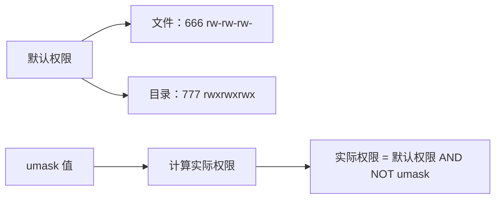
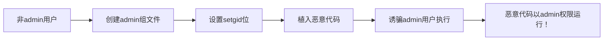
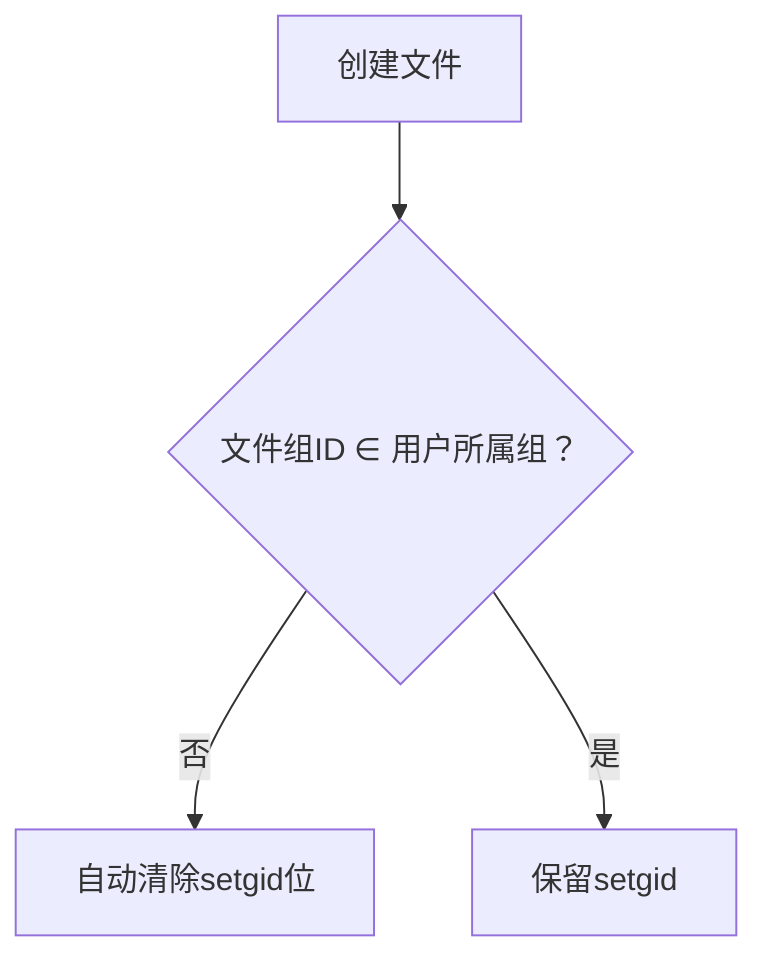
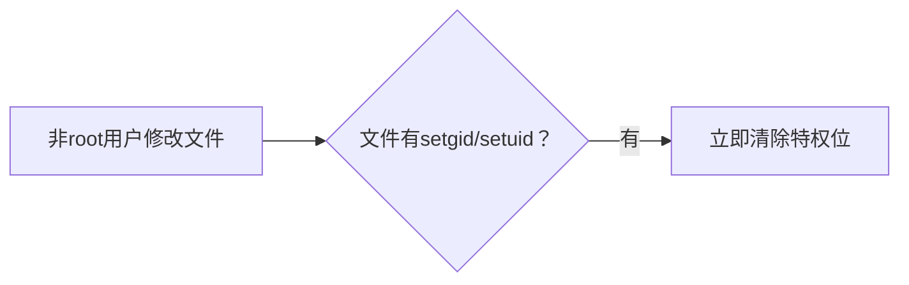

**核心目的：权限控制与最小特权原则**

Unix 是多用户操作系统，需要严格区分不同用户和进程的权限，防止用户或进程越权访问资源（文件、设备、其他进程等）。这些 ID 就是系统用来判断“**这个进程是谁启动的？它现在代表谁在执行？它应该拥有哪些权限？**”的依据。它们的存在就是为了贯彻**最小特权原则**：一个进程只应拥有完成其任务所必需的最小权限。

**核心概念解析：**

1.  **实际用户 ID & 实际组 ID**
    *   **是什么 (What):** 标识**启动这个进程的用户**是谁，以及该用户**登录时所属的主要组**是什么。
    *   **从哪里来 (Where):** 当你登录系统时，登录进程根据你的用户名设置你的实际用户 ID 和实际组 ID。当你运行一个程序时，新创建的进程会**继承**你（父进程）的实际用户 ID 和实际组 ID。
    *   **干什么用 (Why):**
        *   **标识进程的所有者：** 记录“这个进程最初是谁启动的”。
        *   **影响文件创建：** 当你（进程）创建一个新文件时，默认情况下，该文件的所有者 (`ls -l` 看到的) 就是这个实际用户 ID，所属组就是这个实际组 ID（除非目录设置了 SGID 位）。
        *   **发送信号：** 用户通常只能向自己拥有的进程（即 RUID 等于自己 UID 的进程）发送某些信号（如 `SIGKILL`）。
        *   **审计：** 记录谁执行了什么操作。
    *   **特点：** 通常在整个进程生命周期中**保持不变**（除非进程具有超级用户权限）。普通用户进程**无法更改**自己的 RUID/RGID。

2.  **有效用户 ID & 有效组 ID**
    *   **是什么 (What):** 系统在进行**权限检查**（如访问文件、设备、发送特定信号等）时，真正使用的 ID。它决定了**进程当前拥有的权限级别**。
    *   **从哪里来 (Where):** 进程创建时，默认情况下，有效用户 ID **等于**实际用户 ID，有效组 ID **等于**实际组 ID。
    *   **干什么用 (Why):** 这是权限检查的**核心**！当进程尝试执行一个操作（如打开文件 `/etc/shadow`）时：
        *   系统会检查该文件的所有者、组、其他用户的权限位 (`rwx`)。
        *   系统将进程的 **EUID** 与文件的所有者比较。如果匹配，则应用“所有者”权限位。
        *   如果不匹配，系统将进程的 **EGID** 与文件的所属组比较。如果匹配，则应用“所属组”权限位。
        *   如果都不匹配，则应用“其他用户”权限位。
        *   **关键：** 权限检查只看 EUID 和 EGID（以及附加组列表），不看 RUID/RGID！
    *   **特点：** 可以被**改变**（通过系统调用 `seteuid()`, `setegid()`，或执行设置了 SUID/SGID 的程序）。普通用户进程可以将自己的 EUID 设置为 RUID 或保存的设置用户 ID（见下文），超级用户进程可以设置为任意值。EGID 的规则类似。

3.  **设置用户 ID & 设置组 ID**
    *   **是什么 (What):** 这不是一个运行中进程的属性，而是**可执行文件**的一个特殊**属性标志位**。
    *   **作用原理 (How):**
        *   当一个可执行文件的 **SUID 位**被设置时 (`chmod u+s filename` 或 `chmod 4xxx filename`)：
            *   用户执行这个程序时，新进程的**有效用户 ID** 会被设置为该**文件所有者**的 UID，而不是启动它的用户的 RUID！
            *   同时，进程会**记住**它原本的 RUID。
        *   当一个可执行文件的 **SGID 位**被设置时 (`chmod g+s filename` 或 `chmod 2xxx filename`)：
            *   用户执行这个程序时，新进程的**有效组 ID** 会被设置为该**文件所属组**的 GID，而不是启动它的用户的 RGID（或 EGID）。
            *   同时，进程会**记住**它原本的 EGID。
        *   **保存的设置用户 ID & 保存的设置组 ID：** 这是一个**进程状态**。当进程因执行了 SUID/SGID 程序而导致 EUID/EGID 被改变为文件所有者/组的 ID 时，系统会将文件的所有者/组 ID **保存**下来（称为 `saved set-user-ID` / `saved set-group-ID`）。这个保存的 ID 允许进程后续通过 `seteuid()` 等系统调用，在原始 RUID 和文件所有者 ID（或原始 EGID 和文件组 ID）之间**切换** EUID/EGID。
    *   **为什么要有它 (Why):** 这是实现**临时提权**的关键机制！
        *   **核心需求：** 某些操作（如修改密码 `/usr/bin/passwd`，需要写 `/etc/shadow`；`ping` 需要创建原始网络套接字）需要比普通用户更高的权限（通常是 root）。
        *   **问题：** 不可能让所有用户都拥有 root 密码或总是以 root 运行，这太危险。
        *   **SUID/SGID 解决方案：** 系统管理员可以将这些需要特殊权限的程序文件的所有者设置为 root (或其他特权用户/组)，并设置其 SUID (或 SGID) 位。
        *   **执行过程：**
            1.  普通用户 `alice` (RUID=1000) 执行 `/usr/bin/passwd`。
            2.  由于 `/usr/bin/passwd` 文件所有者是 root 且设置了 SUID 位。
            3.  新创建的 `passwd` 进程：
                *   RUID = 1000 (Alice)
                *   EUID = 0 (Root!) <- **关键！临时获得 root 权限**
                *   Saved set-user-ID = 0 (Root) <- 记住文件所有者的 ID
            4.  `passwd` 进程现在拥有 root 权限，可以修改 `/etc/shadow`。
            5.  修改完成后，`passwd` 程序内部通常会调用 `seteuid(getuid())` 将 EUID 切换回 1000 (Alice)，放弃特权。如果需要再次执行特权操作，它可以调用 `seteuid(0)`（因为它保存的设置用户 ID 是 0，所以允许切换回来）。
            6.  进程退出。
        *   **好处：** 普通用户 `alice` 可以在**不需要知道 root 密码、不需要一直拥有 root 权限**的情况下，安全地完成修改自己密码这个需要 root 权限的操作。最小特权原则得到贯彻：`passwd` 进程只在必要时短暂拥有 root 权限，且其代码被严格设计只执行修改密码相关的操作。

**为什么需要这么多 ID？一个总结**

1.  **区分身份与权限 (RUID/RGID vs EUID/EGID):**
    *   `RUID/RGID` 回答“**谁启动了我？**” (身份，文件归属，信号发送权限)。
    *   `EUID/EGID` 回答“**我现在能以什么身份/权限做事？**” (访问控制的核心)。
    *   分离它们允许进程**临时改变权限**（通过改变 EUID/EGID 或执行 SUID/SGID 程序）而不改变其“真实身份”(RUID)。

2.  **实现安全的特权提升 (SUID/SGID + Saved IDs):**
    *   `SUID/SGID` 位提供了一种**可控的、文件级别的**机制，允许特定程序在运行时获得文件所有者的权限。
    *   `Saved set-user-ID/set-group-ID` 提供了**运行时切换**的能力，允许程序在特权任务完成后主动降权，并在需要时（谨慎地）重新获得特权。这比让程序一直保持特权状态安全得多。

**类比理解 (简化版)：**

想象你进入一个高度安全的办公楼：

*   **实际用户 ID (RUID):** 你的员工工牌。它表明你是“张三”，是市场部的员工（实际组 ID）。门卫登记你进来了（进程启动）。
*   **有效用户 ID (EUID):** 你**当前佩戴的通行证**。它决定了你能进入哪些区域、操作哪些设备。
    *   默认情况，你戴着自己的“张三-市场部”通行证（EUID=RUID）。
*   **SUID 位 (在程序文件上)：** 就像大楼里有一个特殊的“服务器机房维护终端”。
    *   这个终端上贴着一个标签：“使用此终端时，自动获得 IT 管理员权限”（文件所有者是 root，设置了 SUID）。
*   **执行 SUID 程序：** 你（张三）走到这个特殊终端前刷卡使用它。
    *   你的“实际工牌”还是张三（RUID 没变）。
    *   但**此时**，系统认为你佩戴的是“IT 管理员”通行证（EUID 变成了 root！）。
    *   系统也记录了你原本有“张三”通行证（保存的设置用户 ID = root， 同时知道你的 RUID=张三）。
*   **权限操作：** 你现在（临时作为 IT 管理员）可以操作服务器了（修改 `/etc/shadow`）。
*   **降权：** 操作完成后，程序让你把“IT 管理员”通行证还回去，重新戴上“张三”通行证（`seteuid(getuid())`， EUID 变回 RUID）。
*   **Saved ID 的作用：** 如果你在使用终端过程中需要短暂离开（比如去拿个工具），你可以暂时交还 IT 管理员证（降权），回来时凭借之前使用过这个终端的事实（Saved ID），再申请戴上 IT 管理员证（提权）继续工作。程序代码控制了这个切换过程。

**重要性与安全提示：**

*   这种机制极其强大，是 Unix 权限体系灵活性的基石。
*   **SUID/SGID (尤其是 SUID root) 程序是重大安全隐患！** 如果这些程序存在漏洞（缓冲区溢出、路径遍历等），攻击者可能利用它们获得 root 权限。因此：
    *   应尽可能减少系统上的 SUID/SGID 程序。
    *   必须对这些程序进行严格的安全审计和编码。
    *   现代系统有更多机制（Capabilities, SELinux/AppArmor）来进一步限制 SUID 程序的权限。

注意: **设置用户 ID / 设置组 ID (SUID/SGID 位) 和 保存的设置 ID：**
    *   **作用：** 这是一个**机制**。
        *   **前提：** 可执行文件**被设置了 SUID/SGID 位** (`chmod u+s` / `chmod g+s`)。
        *   **触发：** 当用户执行这个设置了位的程序时。
        *   **效果：**
            *   进程的 **EUID** (对于 SUID) 或 **EGID** (对于 SGID) **会被临时改变**为该**文件所有者** (对于 SUID) 或**文件所属组** (对于 SGID) 的 ID。
            *   同时，系统会将这个临时的、提升后的 ID (文件所有者的 UID 或文件所属组的 GID) **保存**下来（这就是 **保存的设置用户 ID / 保存的设置组 ID**）。
        *   **目的：** 让进程**暂时“借用”文件所有者（通常是 root 或其他特权用户/组）的身份/权限**去执行特定的、需要更高权限的任务。
        *   **关键操作：** 程序内部代码通常会在**需要特权时**使用保存的设置 ID 将 EUID/EGID 切换到特权状态，在**完成特权操作后**立即切换回实际用户 ID (或其它非特权 ID)，即 `seteuid(getuid())`。这就是你所说的“**之后再切换回原来的用户或用户组**”。
    *   **关键点：** 提供一种**安全的、临时的权限提升机制**，让普通用户能够执行需要更高权限的特定任务（如修改自己的密码），而无需永久拥有或知道特权用户的密码，且严格遵循最小权限原则（只在需要时提权）。


 Unix/Linux 文件权限的核心概念:

**核心概念回顾**

1.  **三种基本权限：**
    *   `r` (Read)：读取权限。
        *   文件：允许读取文件内容（如 `cat`, `less`, `vi` 只读查看）。
        *   目录：允许列出目录内容（如 `ls`）。**注意：** 目录的 `r` 权限本身**不**足以让你进入该目录或访问其内的文件元数据，还需要 `x`。
    *   `w` (Write)：写入权限。
        *   文件：允许修改文件内容（覆盖、追加）、截断文件。**注意：** 删除文件（`rm`）的权限取决于其**父目录**的 `w` 权限。
        *   目录：允许在目录内创建、删除、重命名文件或子目录。**这是目录删除和重命名操作的关键权限！**
    *   `x` (Execute)：执行/搜索权限。
        *   文件：允许将文件作为可执行程序或脚本运行（如 `./script.sh`）。
        *   目录：允许“进入”或“搜索”该目录。这是访问目录内**任何**文件或子目录（包括查看其属性如 `ls -l`，或使用 `cd`）的**必要前提条件**。常被称为“遍历”(traverse) 权限。

2.  **三类权限主体：**
    *   `u` (User/Owner)：文件的所有者。
    *   `g` (Group)：文件所属组的成员。
    *   `o` (Others)：既不是所有者，也不在文件所属组中的其他用户。
    *   `a` (All)：代表 u+g+o。

3.  **权限表示：**
    *   符号表示：`rwxr-xr--`
    *   八进制表示：`755` (rwx=7, r-x=5, r--=4)


1.  **搜索/访问一个文件 (`/path/to/file`) 需要的权限：**
    *   **路径上每个目录的执行权限(`x`):** 这是最关键的规则之一。要访问 `/path/to/file`，用户必须对路径中的 **每一个目录** (`/`, `/path`, `/path/to`) 拥有 **执行(`x`)** 权限。没有这些 `x` 权限，用户甚至无法“到达”文件所在的目录，更别提访问文件本身了。想象 `x` 权限是打开目录门的钥匙。
    *   **目标文件本身的相应权限：** 一旦用户能“进入”到文件所在的目录 (`/path/to`)，接下来就需要对目标 `file` 本身拥有执行其**具体操作**所需的权限：
        *   读取文件内容？需要文件的 `r` 权限。
        *   修改文件内容？需要文件的 `w` 权限。
        *   执行文件？需要文件的 `x` 权限。
    *   **总结访问路径权限：** `x` on `/` + `x` on `/path` + `x` on `/path/to` + (`r`/`w`/`x` on `file`)。

2.  **对一个文件读(`r`)/写(`w`)的权限取决于什么？**
    *   该权限**完全取决于文件本身的权限位** (`rwxr-xr--`) 和**当前操作的用户身份**相对于该文件的关系：
        *   **你是文件的所有者(`u`)?** 看文件 `user` 部分的 `r` 和 `w` 位。
        *   **你不是所有者，但在文件所属的组(`g`)中?** 看文件 `group` 部分的 `r` 和 `w` 位。
        *   **你既不是所有者也不在组里(`o`)?** 看文件 `others` 部分的 `r` 和 `w` 位。
    *   **重要：** 目录的 `w` 权限控制文件在目录内的**创建和删除**，但文件*内容*的读写 (`r`/`w`) **只**由文件自身的权限位决定。

3.  **系统检查程序对某个文件权限的过程：**
    当一个进程（运行中的程序）试图访问一个文件（如打开读取）时，内核执行以下权限检查步骤：

    1.  **识别进程的有效用户ID(EUID)和有效组ID(EGID)：**
        *   大多数情况下，进程的 EUID/EGID 就是启动该进程的用户的真实 UID/GID。
        *   **关键例外 (SUID/SGID)：** 如果程序文件本身设置了 `setuid` (`s` in user exec) 或 `setgid` (`s` in group exec) 位：
            *   `setuid`：进程运行时，其 **EUID** 会被设置为程序**文件所有者**的 UID。
            *   `setgid`：进程运行时，其 **EGID** 会被设置为程序**文件所属组**的 GID。
        *   检查文件权限时，使用的是进程的 **EUID** 和 **EGID**，而不是启动它的用户的真实 UID/GID（除非 EUID/EGID 没因 SUID/SGID 改变）。

    2.  **检查路径遍历权限：**
        *   内核检查进程的 EUID/EGID 是否对目标文件路径中涉及到的**每一个目录** (`/`, `/path`, `/path/to` 对于 `/path/to/file`) 拥有 **执行(`x`)** 权限。如果路径中任何一级目录缺少 `x` 权限，访问**立即被拒绝**。

    3.  **确定权限匹配类别：**
        *   到达目标文件后，内核将进程的 EUID/EGID 与文件的元数据（所有者 UID、所属组 GID）比较：
            *   **EUID == 文件所有者 UID？** -> 使用文件的 `user` (`u`) 权限位。
            *   **如果否，且 EGID == 文件所属组 GID？** -> 使用文件的 `group` (`g`) 权限位。*(注意：系统可能还会检查进程的补充组列表)*
            *   **如果以上都不满足？** -> 使用文件的 `others` (`o`) 权限位。

    4.  **检查请求操作对应的权限位：**
        *   根据上一步确定的权限类别 (`u`, `g`, 或 `o`)，检查该类别中对应的权限位是否被设置：
            *   请求读 (`open for read`)？检查 `r` 位。
            *   请求写 (`open for write`, `truncate`)？检查 `w` 位。
            *   请求执行 (`execve`)? 检查 `x` 位。
        *   如果请求的操作对应的权限位被设置，则访问被允许。
        *   如果没有设置，则访问被拒绝。

**总结流程图 (进程访问文件 `/a/b/c`)：**

```
+---------------------+
| 进程尝试访问 /a/b/c   |
+---------------------+
          |
          v
+---------------------+
| 1. 获取进程的 EUID/EGID |
|   (受 SUID/SGID 影响) |
+---------------------+
          |
          v
+-----------------------------------------------+
| 2. 检查路径遍历权限:                           |
|   - EUID/EGID 对目录 / 有 x 权限?             |-- No --> EACCES (Permission denied)
|   - EUID/EGID 对目录 /a 有 x 权限?            |-- No --> EACCES
|   - EUID/EGID 对目录 /a/b 有 x 权限?          |-- No --> EACCES
+-----------------------------------------------+
          |
         Yes
          v
+-----------------------------------------------+
| 3. 到达文件 /a/b/c. 确定权限类别:             |
|   - EUID == c 的所有者?       --> 用 u 权限    |
|   - 否? EGID == c 的组?       --> 用 g 权限    |
|   - 否?                      --> 用 o 权限    |
+-----------------------------------------------+
          |
          v
+-----------------------------------------------+
| 4. 检查请求的操作:                            |
|   - 请求读? 检查对应类别(u/g/o)的 r 位设置?   |-- No --> EACCES
|   - 请求写? 检查对应类别(u/g/o)的 w 位设置?   |-- No --> EACCES
|   - 请求执行? 检查对应类别(u/g/o)的 x 位设置? |-- No --> EACCES
+-----------------------------------------------+
          |
         Yes
          v
+---------------------+
| 访问被允许！         |
+---------------------+
```

**关键记忆点：**

*   **目录 `x` 是通行证：** 没有路径上所有目录的 `x` 权限，文件本身权限再大也访问不到。
*   **文件权限决定内容操作：** 文件的 `r`/`w` 位直接控制对其内容的读写。
*   **目录 `w` 控制结构：** 目录的 `w` 位控制在该目录内创建/删除/重命名文件（改变目录内容列表）。
*   **EUID/EGID 是关键：** 权限检查基于**进程的 EUID/EGID**，这受 SUID/SGID 影响。
*   **匹配顺序：** 权限类别匹配顺序是 `用户(u) -> 组(g) -> 其他(o)`，匹配到即停。
*   **`ls -l` 看权限：** 理解 `ls -l` 的输出是查看权限的基础。
*   **`stat` 看细节：** `stat` 命令可以查看更详细的文件信息（包括 inode、权限八进制值、UID、GID 等）。

在 Unix/Linux 系统中，新创建文件的组所有权（Group Ownership）有两种可能的来源，这种设计具有重要的协作意义：

### 两种组所有权来源
1. **进程的有效组ID (Effective GID)**  
   - 默认情况：新文件继承创建者进程的**有效组ID**（通常是用户的主组/primary group）
   - 示例：用户 `alice`（主组为 `staff`）创建文件 → 文件组为 `staff`

2. **父目录的组ID (Parent Directory's GID)**  
   - 触发条件：当**父目录设置了 `setgid` 位**时（权限位中的 `s`）
   - 示例：目录 `/team/project` 设置了 `setgid` 且组为 `dev-team` → 在此目录下新建文件自动属于 `dev-team` 组

### 为什么需要这两种选择？（设计意义）
这种双重机制解决了团队协作中的关键问题：

#### 1. **默认情况（继承进程GID）的意义**
   - **符合个人工作习惯**  
     用户在自己的主目录工作时，文件自动归属个人主组（如 `alice:alice`），避免权限混乱
   - **简化个人文件管理**  
     不需要特殊配置即可正常使用

#### 2. **继承目录组（`setgid`）的核心意义**
   - **团队协作的核心机制**  
     ```mermaid
     graph LR
     A[共享目录] --> B[设置 setgid]
     B --> C[所有新建文件自动继承目录组]
     C --> D[同组成员无需修改即可协作]
     ```
   - **解决共享痛点**：
     - 避免手动调整：用户无需每次创建文件后手动 `chgrp`
     - 防止权限碎片化：确保目录下所有文件归属统一组（如 `project-team`）
     - 消除访问障碍：同组成员可直接读写文件（配合合理的 `umask`）

   - **典型应用场景**：
     - 开发团队的代码仓库：`/git/projectX`（组=`dev-team`）
     - 部门共享文件夹：`/dept/finance`（组=`finance`）
     - 学术研究数据：`/research/data`（组=`bio-team`）

### 工作流程对比
| 场景                 | 无 setgid 的目录         | 有 setgid 的目录          |
|----------------------|--------------------------|---------------------------|
| **创建者**           | alice (主组=staff)       | bob (主组=staff)          |
| **目录组**           | project (组=dev-team)    | project (组=dev-team)     |
| **新文件组所有权**   | staff (创建者主组)       | dev-team (目录组)         |
| **同组成员访问**     | 需要手动 `chgrp` 或 ACL  | 直接可读写（权限允许时）  |

### 技术实现原理
```bash
# 设置目录的 setgid 位（2 表示 setgid）
$ chmod g+s /shared-dir   
$ chmod 2775 /shared-dir  # 常用权限

# 验证设置（目录权限中的 's'）
$ ls -ld /shared-dir
drwxrwsr-x  2 root  dev-team  4096 Aug 15 10:00 /shared-dir
                                  ^ 这里的 's' 表示 setgid 生效
```

### 为什么不能只有一种方式？
1. **灵活性需求**  
   个人工作空间和团队空间需要不同的权限策略
   
2. **历史兼容性**  
   早期 Unix 只有进程组继承，`setgid` 是为解决协作问题增加的扩展

3. **最小权限原则**  
   个人文件默认不暴露给其他组，除非显式放入共享目录

### 最佳实践建议
1. 个人目录：保持默认（无 `setgid`）
2. 共享目录：
   ```bash
   # 创建协作目录
   mkdir /team/project
   chgrp dev-team /team/project
   chmod g+s /team/project  # 关键设置！
   setfacl -d -m g::rwx /team/project  # 可选：设置默认ACL
   ```
3. 配合 `umask 0002` 确保组成员有写权限

> **关键结论**：这种双重机制完美平衡了个人隐私和团队协作的需求。`setgid` 继承目录组的设计，是 Unix 解决多用户协作问题的经典方案，使团队共享从"需要管理员干预"变为"自动生效"，大幅提升了系统在协作场景下的可用性。


### access 和 faccessat 函数总结

#### 1. **`access()` 函数**
```c
#include <unistd.h>
int access(const char *pathname, int mode);
```
**作用**：  
检查**实际用户**（启动进程的用户）对文件的访问权限。

**参数**：
- `pathname`：文件路径
- `mode`：权限检查标志（位掩码）：
  - `F_OK`：文件是否存在
  - `R_OK`：是否可读
  - `W_OK`：是否可写
  - `X_OK`：是否可执行

**特点**：
- 基于**实际用户ID/组ID**（Real UID/GID）
- **总是跟随符号链接**（检查链接指向的文件）
- 不适用于特权程序（如 setuid/setgid 程序）

**返回值**：
- 成功：0（所有请求权限满足）
- 失败：-1（设置 errno，如 `EACCES` 权限不足）

---

#### 2. **`faccessat()` 函数**
```c
#include <fcntl.h>
int faccessat(int dirfd, const char *pathname, int mode, int flags);
```
**作用**：  
增强版文件权限检查，提供更多控制选项。

**参数**：
- `dirfd`：目录文件描述符（或 `AT_FDCWD` 表示当前目录）
- `pathname`：文件路径（相对/绝对）
- `mode`：同 `access()` 的权限标志
- `flags`：行为控制标志：
  - `AT_EACCESS`：使用**有效用户ID/组ID**（而非实际用户）
  - `AT_SYMLINK_NOFOLLOW`：不跟随符号链接（检查链接本身）

**核心优势**：
1. **相对路径支持**  
   通过 `dirfd` 指定基准目录（避免路径竞态条件）
2. **特权程序兼容**  
   `AT_EACCESS` 让 setuid/setgid 程序检查**运行时权限**
3. **符号链接控制**  
   `AT_SYMLINK_NOFOLLOW` 直接检查链接文件自身权限

---

### 关键区别对比表
| 特性                | `access()`                  | `faccessat()`                          |
|---------------------|-----------------------------|----------------------------------------|
| **权限检查主体**     | 实际用户 (Real UID/GID)      | 默认同左，`AT_EACCESS` 时用有效用户     |
| **符号链接处理**     | 总是跟随                    | `AT_SYMLINK_NOFOLLOW` 时不跟随         |
| **路径解析基准**     | 当前工作目录                | 通过 `dirfd` 指定目录                  |
| **setuid 程序适用性**| 不适用（检查错误主体）       | 适用（配合 `AT_EACCESS`）              |
| **安全系数**         | 较低（可能竞态条件）         | 较高（相对路径 + 文件描述符）          |

---


### 一句话总结
- **`access()`**：基础权限检查，适合普通程序验证**实际用户**的文件权限
- **`faccessat()`**：高级权限检查，支持相对路径/有效用户/符号链接控制，适合安全敏感场景

在 Unix/Linux 系统中，**屏蔽字（umask）** 是一个非常重要的权限控制机制，它决定了新创建文件和目录的**默认权限**。简单来说，umask 是一个"权限过滤器"，用于从完全开放的权限中"屏蔽掉"（减去）特定权限。

### 核心概念解析

#### 1. **umask 的作用**
- **创建文件时**：系统默认权限是 `666` (rw-rw-rw-)
- **创建目录时**：系统默认权限是 `777` (rwxrwxrwx)
- **umask 的工作**：从这些默认权限中"减去"指定的权限

#### 2. **umask 的表示形式**
- 通常用 **4 位八进制数** 表示（如 `0022`）
- 实际使用时通常省略前导零（写作 `022`）
- 每位对应三类用户：
  ```
  0 - 特殊权限（setuid/setgid/sticky）
  1 - 用户(user)权限
  2 - 组(group)权限
  3 - 其他用户(other)权限
  ```

### 工作原理解析


#### 示例：umask 022 的效果
| 类型   | 默认权限 | 计算过程            | 实际权限 |
|--------|----------|---------------------|----------|
| 文件   | 666      | 666 AND NOT 022     | 644      |
|        | rw-rw-rw-| 屏蔽掉 group 的 w<br>屏蔽掉 other 的 w | rw-r--r-- |
| 目录   | 777      | 777 AND NOT 022     | 755      |
|        | rwxrwxrwx| 屏蔽掉 group 的 w<br>屏蔽掉 other 的 w | rwxr-xr-x |

### 常见 umask 值及效果
| umask | 文件权限 | 目录权限 | 适用场景               |
|-------|----------|----------|------------------------|
| 000   | 666 → rw-rw-rw- | 777 → rwxrwxrwx | 完全开放（测试环境）   |
| 002   | 664 → rw-rw-r-- | 775 → rwxrwxr-x | 组内协作（用户同组）   |
| 022   | 644 → rw-r--r-- | 755 → rwxr-xr-x | 标准安全设置（默认）   |
| 027   | 640 → rw-r----- | 750 → rwxr-x--- | 严格保护（仅用户和组） |
| 077   | 600 → rw------- | 700 → rwx------ | 完全私有               |

### 关键特性
1. **进程级设置**：
   - 每个 shell/进程有自己的 umask
   - 通过 `umask` 命令查看/设置
   ```bash
   $ umask       # 查看当前值
   0022
   $ umask 027   # 设置为027
   ```

2. **继承规则**：
   - 子进程继承父进程的 umask
   - 登录时由 shell 配置文件设置（如 `~/.bashrc`）

3. **特殊权限处理**：
   - 文件默认不会获得执行权限
   - 目录会保留执行权限（用于访问）

### 为什么需要 umask？
1. **安全防护**  
   防止意外创建过度开放的文件（如 world-writable）

2. **权限标准化**  
   确保团队环境中权限一致性

3. **隐私保护**  
   自动限制其他用户的访问权限

4. **符合最小权限原则**  
   自动应用"刚好足够"的权限

### 实际应用技巧
```bash
# 创建更安全的临时目录
$ umask 077
$ mkdir secure-tmp
$ touch secure-tmp/file

# 查看结果
$ ls -ld secure-tmp
drwx------   2 user group  secure-tmp
$ ls -l secure-tmp/file
-rw-------   1 user group  file
```

### 一句话总结
> **umask 是 Unix 的权限守门人**：它通过屏蔽掉默认权限中的敏感部分（主要是写权限），确保新创建的文件和目录自动获得安全合理的访问控制，是系统安全的第一道自动防线。

以下是为您整理的清晰复习摘要，结合了您的理解和核心机制解释，方便快速回顾：

---

### ⭐ Unix 文件权限安全机制精要
#### 1. **setgid 的核心作用**
```bash
-rwxr-sr-x 1 root admin 程序  # 关键：组权限位的 "s"
```
- ✅ **合法场景**：当属于 `admin` 组的用户创建 setgid 程序时
  - 任何用户执行该程序 → 进程获得 **`admin` 组权限**
  - 程序可执行特权操作：  
    ```c
    access("/admin/data", R_OK);  // 访问仅admin组可读的文件
    setegid(admin_gid);           // 使用admin组权限执行操作
    ```

#### 2. **安全漏洞风险**
假设无防御机制：

➤ **后果**：普通用户可构造陷阱程序，劫持高权限身份

---

### 🛡️ 系统的双重防御机制
#### 防御层1：创建时阻断非法 setgid

**您的精准总结**：  
> “当你不是这个组的成员时，创建的文件的设置组ID会自动消除”

**示例**：  
- 您（组 `users`）创建 `admin` 组文件 → setgid 位被静默清除  
  ```bash
  # 实际结果（无"s"位）：
  -rwxr-xr-x 1 you admin 文件
  ```

#### 防御层2：写入时清除特权位

**您的精准总结**：  
> “如果不这样，普通用户就能用 admin 权限设置恶意代码提权”

**示例**：  
即使恶意用户找到可写的 admin 组程序：
```bash
chmod o+w /admin/tool  # 错误配置：其他用户可写
echo "恶意代码" > /admin/tool  # 写入瞬间触发防御
# 结果：-rwxr-xr-x 程序（setgid位已消失！）
```

---

### 📜 机制对比表（合法 vs 非法场景）
| 操作                 | 合法用户（admin组成员）       | 恶意用户（非admin组）          |
|----------------------|-----------------------------|-------------------------------|
| **创建admin组文件**  | 允许                        | 允许                          |
| **设置setgid位**     | 成功保留 (`rwsr-sr-x`)      | 静默失败 (`rwxr-xr-x`)        |
| **写入程序代码**     | 保留setgid位                | 写入时自动清除setgid          |
| **程序执行效果**     | 获得admin组权限（正常）      | 仅普通权限（无法提权）        |

---

### 💎 核心结论
1. **setgid 本质**  
   让程序运行时获得**文件所属组**的权限（需配合代码实现）

2. **防御机制目的**  
   遵守 **"最小权限原则"**，确保：
   - 只有真正的组内成员能创建该组的特权程序
   - 即使配置失误（文件意外可写），也无法被利用提权

3. **您的终极总结**  
   > “这个机制阻止普通用户伪造高权限程序：  
   > - 非组成员创建 setgid 文件时自动降权  
   > - 写入时强制清除特权位  
   > 从根本上杜绝了恶意提权漏洞！”

---

将此页保存为快速参考，每次复习只需 2 分钟即可掌握精髓！遇到实践场景时，重点观察文件权限位中的 `s` 标志和组归属关系，便能直观理解系统如何守护安全。